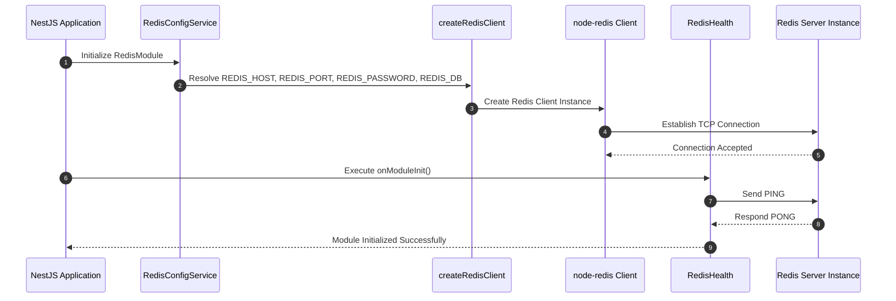
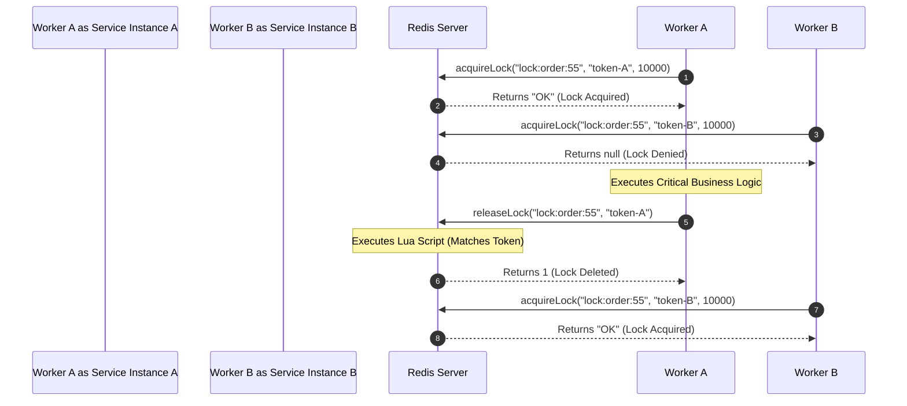

# @bts-soft/cache

Production-Grade Redis Infrastructure and Specialized Micro-Service Abstraction for NestJS.

---

## Overview

`@bts-soft/cache` is an enterprise Redis abstraction layer designed specifically for high-throughput, mission-critical NestJS microservices and web applications. Moving beyond standard key-value caching, this package provides a unified **Facade Architecture** backed by 15 specialized domain services. It natively handles automatic JSON serialization, atomic distributed locking via Redlock/Lua scripts, isolated Pub/Sub event streams, robust message queuing via Redis Streams, probabilistic counting, geospatial queries, and atomic pipelines.

---

## Architecture Highlights

* **Unified Facade Pattern**: Developers interface with a single `RedisService` dependency while underlying logic is strictly decoupled across 15 single-responsibility domain services.
* **Isolated Pub/Sub Messaging**: Uses duplicated client sockets dedicated strictly to subscription listener loops to prevent blocking primary transactional Redis commands.
* **Redis Streams Support**: Robust integration with Redis Streams and Consumer Groups for building reliable, persistent event-driven architectures.
* **Redlock Distributed Locking**: Built-in atomic lock acquisition using `NX PX` flags paired with Lua scripts for safe, atomic lock releases and extensions.
* **Transparent Type Handling & Serialization**: Automates JSON stringification and parsing across all complex data structures including Hashes, Lists, Sets, and Key-Value stores.
* **Hybrid Core Driver Architecture**: Combines `node-redis v4` for fast command execution with `@nestjs/cache-manager` and `cache-manager-ioredis` for standard framework caching workflows.
* **Native Health Verification**: Built-in `RedisHealth` component executing `PING` checks during module initialization.

---

## System Requirements

* Node.js >= 20.17.0
* NestJS >= 11.0.0
* Redis Server >= 6.2.0 (Compatible with Redis 7.x)

---

## Installation

```bash
npm install @bts-soft/cache
```

### Peer Dependencies

Ensure your NestJS core packages are installed:

```bash
npm install @nestjs/common @nestjs/core
```

---

## Configuration & Setup

### 1. Register Module in NestJS

Import `RedisModule` into your root `AppModule` or feature modules:

```typescript
import { Module } from '@nestjs/common';
import { RedisModule } from '@bts-soft/cache';

@Module({
  imports: [RedisModule],
})
export class AppModule {}
```

### 2. Environment Variables

The package automatically reads configuration settings from process environment variables:

| Environment Variable | Description | Default Value | Required |
| :--- | :--- | :--- | :--- |
| `REDIS_HOST` | Redis instance hostname or IP address | `localhost` | No |
| `REDIS_PORT` | Redis instance port number | `6379` | No |
| `REDIS_PASSWORD` | Security credential / authentication password | `undefined` | No |
| `REDIS_DB` | Target database index (0-15) | `0` | No |
| `REDIS_TTL` | Default cache expiry window in seconds | `3600` | No |



---

## Service Domain Architecture

The module exports `RedisService`, which implements `IRedisInterface`. The table below outlines the 15 specialized internal domain services and their responsibilities:

| Domain Service | Responsibility | Key Operations |
| :--- | :--- | :--- |
| **CoreRedisService** | Primary K/V cache operations with JSON support and cache-aside | `set`, `setForever`, `get`, `getOrSet`, `del`, `update`, `mSet`, `setNX` |
| **StringRedisService** | Advanced string manipulation and range queries | `getSet`, `strlen`, `append`, `getRange`, `setRange`, `mGet` |
| **NumberRedisService** | Atomic numeric increments and decrements | `incr`, `incrBy`, `incrByFloat`, `decr`, `decrBy` |
| **HashRedisService** | Object-like field-value dictionary storage | `hSet`, `hGet`, `hGetAll`, `hDel`, `hExists`, `hKeys`, `hVals`, `hLen`, `hIncrBy`, `hIncrByFloat`, `hSetNX` |
| **ListORedisService** | Ordered sequence management, queues, and stacks | `lPush`, `rPush`, `lPop`, `rPop`, `lRange`, `lLen`, `lIndex`, `lInsert`, `lRem`, `lTrim`, `rPopLPush`, `lSet`, `lPos` |
| **OperationRedisService** | Set theory operations and unique collections | `sAdd`, `sRem`, `sMembers`, `sIsMember`, `sCard`, `sPop`, `sMove`, `sDiff`, `sDiffStore`, `sInter`, `sInterStore`, `sUnion`, `sUnionStore` |
| **SortedORedisService** | Priority queues and scored real-time rankings | `zAdd`, `zRange`, `zRangeByScore`, `zRevRange`, `zCard`, `zScore`, `zRank`, `zRevRank`, `zIncrBy`, `zRem`, `zRemRangeByRank`, `zRemRangeByScore`, `zCount`, `zUnionStore`, `zInterStore` |
| **GeoRedisService** | Coordinate tracking and proximity queries | `geoAdd`, `geoPos`, `geoDist`, `geoHash`, `geoRemove` |
| **HyperLogLogRedisService** | Memory-efficient unique cardinality estimation | `pfAdd`, `pfCount`, `pfMerge`, `pfDebug`, `pfClear` |
| **LockRedisService** | Distributed concurrency locking and mutexes | `acquireLock`, `releaseLock`, `extendLock`, `isLocked`, `getLockValue`, `waitForLock` |
| **PubSubRedisService** | Dedicated multi-channel real-time event routing | `publish`, `subscribe`, `pSubscribe`, `unsubscribe`, `pUnsubscribe`, `getSubscriptions`, `getChannels`, `getSubCount`, `createMessageHandler` |
| **TransactionRedisService** | Multi-command atomic pipelines and OCC transactions | `multiExecute`, `watch`, `unwatch`, `withTransaction`, `discard`, `transactionGetSet` |
| **StreamRedisService** | Persistent event sourcing and reliable message queuing | `xAdd`, `xRead`, `xGroupCreate`, `xReadGroup`, `xAck`, `xLen` |
| **BitmapRedisService** | Highly efficient boolean flags and population counting | `setBit`, `getBit`, `bitCount`, `bitOp` |
| **UtilityRedisService** | Key expiration, non-blocking pattern eviction, and Lua | `exists`, `expire`, `ttl`, `persist`, `pttl`, `delByPattern`, `eval` |

---

## Comprehensive API Reference & Usage Code Examples

### 1. Core Key-Value Operations

Inject `RedisService` into your controllers or providers:

```typescript
import { Injectable } from '@nestjs/common';
import { RedisService } from '@bts-soft/cache';

@Injectable()
export class UserService {
  constructor(private readonly redisService: RedisService) {}

  async cacheUserProfile(userId: string, profile: object): Promise<void> {
    // Store profile with custom TTL of 1800 seconds
    await this.redisService.set(`user:${userId}`, profile, 1800);
  }

  async getUserProfile<T>(userId: string): Promise<T | null> {
    // Automatically parses JSON string back into structured object
    return await this.redisService.get<T>(`user:${userId}`);
  }

  async persistSystemConfiguration(config: object): Promise<void> {
    // Save without TTL expiration
    await this.redisService.setForever('system:global_config', config);
  }

  async updateSession(userId: string, data: object): Promise<void> {
    // Delete existing key and write updated value atomically
    await this.redisService.update(`session:${userId}`, data, 3600);
  }

  async batchSetUsers(users: Record<string, any>): Promise<void> {
    // Atomic multi-set pipeline
    await this.redisService.mSet({
      'user:101': { name: 'Alice', role: 'admin' },
      'user:102': { name: 'Bob', role: 'developer' },
    });
  }

  async setUniqueReservation(reservationId: string): Promise<boolean> {
    // Returns true only if key did not previously exist (Set if Not eXists)
    return await this.redisService.setNX(`reservation:${reservationId}`, 'claimed', 300);
  }
}
```

---

### 2. Distributed Locking & Concurrency Control

Prevent concurrent execution across microservice nodes when processing payments or critical tasks.



```typescript
import { Injectable, Logger } from '@nestjs/common';
import { RedisService } from '@bts-soft/cache';
import { randomUUID } from 'crypto';

@Injectable()
export class PaymentProcessingService {
  private readonly logger = new Logger(PaymentProcessingService.name);

  constructor(private readonly redisService: RedisService) {}

  async processPayment(orderId: string): Promise<void> {
    const lockKey = `lock:payment:${orderId}`;
    const ownerToken = randomUUID();
    const ttlMs = 10000;

    // Acquire lock with 10s expiration
    const acquired = await this.redisService.acquireLock(lockKey, ownerToken, ttlMs);

    if (!acquired) {
      this.logger.warn(`Order ${orderId} is currently being processed by another instance.`);
      return;
    }

    try {
      // Execute sensitive processing logic
      await this.executePaymentGatewayTransaction(orderId);
    } finally {
      // Safely release lock using Lua script to verify token ownership
      await this.redisService.releaseLock(lockKey, ownerToken);
    }
  }

  async processWithRetry(taskKey: string): Promise<void> {
    const lockKey = `lock:task:${taskKey}`;
    const ownerToken = randomUUID();

    // Poll until lock is acquired or timeout (5 seconds) expires
    const acquired = await this.redisService.waitForLock(
      lockKey,
      ownerToken,
      10000, // Lock TTL
      150,   // Retry interval in ms
      5000,  // Max timeout in ms
    );

    if (acquired) {
      try {
        // Perform processing
      } finally {
        await this.redisService.releaseLock(lockKey, ownerToken);
      }
    }
  }
}
```

---

### 3. Isolated Real-Time Pub/Sub Messaging

Publish events and process messages without blocking primary cache read/write connections.

```mermaid
graph LR
    subgraph Publisher Microservice
        P[Publisher Code] -->|Publish Event| PrimarySocket[Primary Redis Connection]
    End

    PrimarySocket -->|PUBLISH channel| RedisServer[(Redis Server)]

    subgraph Subscriber Microservice
        RedisServer -->|Deliver Message| SubSocket[Dedicated Subscriber Socket]
        SubSocket -->|Parse JSON & Invoke| Callback[Subscriber Handler Callback]
    End
```

```typescript
import { Injectable, OnModuleInit } from '@nestjs/common';
import { RedisService } from '@bts-soft/cache';

@Injectable()
export class NotificationService implements OnModuleInit {
  constructor(private readonly redisService: RedisService) {}

  async onModuleInit() {
    // Subscribe to specific channel with automatic JSON deserialization
    await this.redisService.subscribe('order_events', (data: any, channel: string) => {
      console.log(`Received event on ${channel}:`, data);
    });

    // Subscribe using wildcard patterns
    await this.redisService.pSubscribe('user:*', (data: any, channel: string) => {
      console.log(`Pattern match event on ${channel}:`, data);
    });
  }

  async notifyOrderCreated(order: object): Promise<void> {
    // Publish payload to channel
    await this.redisService.publish('order_events', {
      eventId: 'evt_9901',
      order,
      timestamp: new Date().toISOString(),
    });
  }
}
```

---

### 4. Hash Dictionary Operations

Store structured, object-level datasets where individual fields need atomic reads and writes.

```typescript
import { Injectable } from '@nestjs/common';
import { RedisService } from '@bts-soft/cache';

@Injectable()
export class SessionManagerService {
  constructor(private readonly redisService: RedisService) {}

  async storeSessionData(sessionId: string): Promise<void> {
    const key = `hash:session:${sessionId}`;

    // Set individual fields with JSON stringification
    await this.redisService.hSet(key, 'ip', '192.168.1.1');
    await this.redisService.hSet(key, 'metadata', { device: 'mobile', os: 'iOS' });

    // Retrieve specific field with automatic JSON parsing
    const metadata = await this.redisService.hGet<{ device: string; os: string }>(key, 'metadata');

    // Retrieve all fields parsed into an object
    const session = await this.redisService.hGetAll(key);

    // Atomically increment numeric hash fields
    await this.redisService.hIncrBy(key, 'login_count', 1);
  }
}
```

---

### 5. Sorted Sets & Real-Time Leaderboards

Maintain ordered sets scored by floating-point numbers for rankings, leaderboards, and priority queues.

```typescript
import { Injectable } from '@nestjs/common';
import { RedisService } from '@bts-soft/cache';

@Injectable()
export class LeaderboardService {
  private readonly leaderboardKey = 'leaderboard:weekly_scores';

  constructor(private readonly redisService: RedisService) {}

  async recordScore(userId: string, score: number): Promise<void> {
    await this.redisService.zAdd(this.leaderboardKey, score, userId);
  }

  async incrementUserScore(userId: string, delta: number): Promise<number> {
    return await this.redisService.zIncrBy(this.leaderboardKey, delta, userId);
  }

  async getTopPlayers(limit: number): Promise<string[]> {
    // Get top N player IDs in descending score order
    return await this.redisService.zRevRange(this.leaderboardKey, 0, limit - 1);
  }

  async getUserRank(userId: string): Promise<number | null> {
    // Zero-based rank (highest score receives rank 0)
    return await this.redisService.zRevRank(this.leaderboardKey, userId);
  }
}
```

---

### 6. Atomic Pipelines & Transactions

Execute grouped Redis commands atomically using optimistic concurrency control (`WATCH` / `MULTI` / `EXEC`).

```typescript
import { Injectable } from '@nestjs/common';
import { RedisService } from '@bts-soft/cache';

@Injectable()
export class InventoryService {
  constructor(private readonly redisService: RedisService) {}

  async executeBatchInventoryUpdate(): Promise<void> {
    // Multi-command raw pipeline
    const results = await this.redisService.multiExecute([
      ['SET', 'item:1001:stock', '50'],
      ['SET', 'item:1002:stock', '120'],
      ['INCRBY', 'item:1001:stock', '-2'],
    ]);
  }

  async transferStockWithOptimisticLocking(sourceKey: string, destKey: string, amount: number): Promise<void> {
    // Execute transaction watching specified keys for concurrency conflict
    await this.redisService.withTransaction(
      [sourceKey],
      (multi) => {
        multi.incrBy(sourceKey, -amount);
        multi.incrBy(destKey, amount);
      },
      5, // Retry up to 5 times on conflict
    );
  }
}
```

---

### 7. Geospatial Coordinates & Proximity Queries

Track spatial locations and calculate distance metrics.

```typescript
import { Injectable } from '@nestjs/common';
import { RedisService } from '@bts-soft/cache';

@Injectable()
export class LogisticsService {
  private readonly geoKey = 'drivers:locations';

  constructor(private readonly redisService: RedisService) {}

  async updateDriverLocation(driverId: string, longitude: number, latitude: number): Promise<void> {
    await this.redisService.geoAdd(this.geoKey, longitude, latitude, driverId);
  }

  async getDriverDistance(driverA: string, driverB: string): Promise<number> {
    // Calculate distance in kilometers ('m' | 'km' | 'mi' | 'ft')
    return await this.redisService.geoDist(this.geoKey, driverA, driverB, 'km');
  }

  async getDriverPosition(driverId: string): Promise<{ longitude: string; latitude: string }[]> {
    return await this.redisService.geoPos(this.geoKey, driverId);
  }
}
```

---

### 8. HyperLogLog Probabilistic Cardinality

Estimate unique visitor counts using minimal fixed memory footprint (~12 KB).

```typescript
import { Injectable } from '@nestjs/common';
import { RedisService } from '@bts-soft/cache';

@Injectable()
export class AnalyticsService {
  constructor(private readonly redisService: RedisService) {}

  async trackUniqueVisitor(pageId: string, visitorId: string): Promise<void> {
    await this.redisService.pfAdd(`hll:page:${pageId}`, visitorId);
  }

  async getUniqueVisitorCount(pageId: string): Promise<number> {
    return await this.redisService.pfCount(`hll:page:${pageId}`);
  }

  async aggregateTotalVisitors(targetKey: string, ...sourceKeys: string[]): Promise<void> {
    await this.redisService.pfMerge(targetKey, ...sourceKeys);
  }
}
```

### 9. Redis Streams & Consumer Groups

Persistent, append-only logs for reliable event-driven messaging and message queuing.

```typescript
import { Injectable } from '@nestjs/common';
import { RedisService } from '@bts-soft/cache';

@Injectable()
export class EventSourcingService {
  private readonly streamKey = 'events:orders';
  private readonly groupName = 'workers:orders';

  constructor(private readonly redisService: RedisService) {}

  async appendOrderEvent(orderData: Record<string, any>): Promise<string> {
    // Automatically stringifies complex objects inside the message
    return await this.redisService.xAdd(this.streamKey, orderData);
  }

  async initializeConsumerGroup(): Promise<void> {
    try {
      // Create group starting from latest messages ('$'), creating stream if it doesn't exist
      await this.redisService.xGroupCreate(this.streamKey, this.groupName, '$', true);
    } catch (error) {
      // Ignore BUSYGROUP error if it already exists
    }
  }

  async processPendingEvents(workerName: string): Promise<void> {
    // Read up to 10 new messages for this consumer group, blocking for 5 seconds
    const result = await this.redisService.xReadGroup(
      this.groupName,
      workerName,
      [{ key: this.streamKey, id: '>' }],
      10,
      5000
    );

    if (result && result[this.streamKey]) {
      const messages = result[this.streamKey];
      for (const msg of messages) {
        // msg.message is automatically parsed back to an object
        console.log(`Processing event ${msg.id}:`, msg.message);
        
        // Acknowledge processing
        await this.redisService.xAck(this.streamKey, this.groupName, msg.id);
      }
    }
  }
}
```

---

### 10. Bitmaps

Highly efficient boolean flags and population counting. Ideal for tracking Daily Active Users (DAU), user features, or presence.

```typescript
import { Injectable } from '@nestjs/common';
import { RedisService } from '@bts-soft/cache';

@Injectable()
export class UserActivityService {
  constructor(private readonly redisService: RedisService) {}

  async recordUserLogin(userId: number, dateStr: string): Promise<void> {
    const key = \`dau:\${dateStr}\`;
    // Set the bit corresponding to the user's integer ID to 1
    await this.redisService.setBit(key, userId, 1);
  }

  async checkUserLogin(userId: number, dateStr: string): Promise<boolean> {
    const bit = await this.redisService.getBit(\`dau:\${dateStr}\`, userId);
    return bit === 1;
  }

  async getTotalActiveUsers(dateStr: string): Promise<number> {
    // Count all 1s in the bitmap
    return await this.redisService.bitCount(\`dau:\${dateStr}\`);
  }

  async calculateWeeklyActiveUsers(weekStr: string, ...dailyKeys: string[]): Promise<number> {
    const destKey = \`wau:\${weekStr}\`;
    // Perform bitwise OR across multiple days to find unique users
    await this.redisService.bitOp('OR', destKey, ...dailyKeys);
    return await this.redisService.bitCount(destKey);
  }
}
```

---

## Error Handling & Resiliency

All domain services wrap Redis driver execution in structured `try / catch` blocks. When an underlying command fails, details are logged to NestJS `Logger` with context stack traces before rethrowing the exception.

```typescript
try {
  await this.redisService.get('invalid:key');
} catch (error) {
  // Handles connection timeout, node failure, or Redis protocol errors
  console.error('Redis operation failed:', error.message);
}
```

---

## Testing & Verification

The package contains a comprehensive suite of Unit and End-to-End (E2E) integration tests.

### Running Unit Tests

Unit tests execute using `ioredis-mock` without requiring an active Redis server:

```bash
npm run test
```

### Running Coverage Analysis

```bash
npm run test:cov
```

### Running E2E Integration Tests

E2E tests verify real socket connections against an active Redis instance running on port `6380` (or configured environment port):

```bash
npm run test:e2e
```

---

## License

This project is licensed under the **MIT License**.

---

## Author

Omar Sabry

* Portfolio: [omarsabry.varcel.app](https://omarsabry.varcel.app/)
* GitHub: [Omar-Sa6ry](https://github.com/Omar-Sa6ry)
