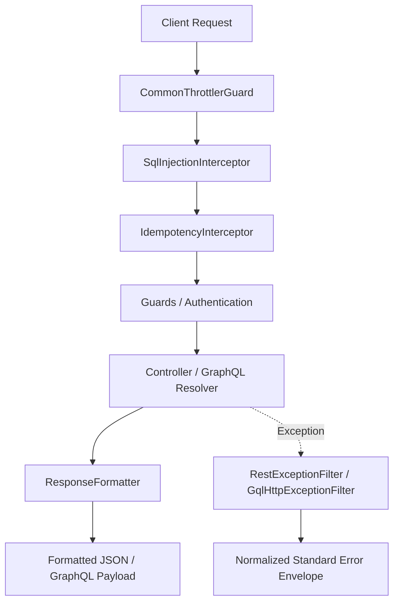
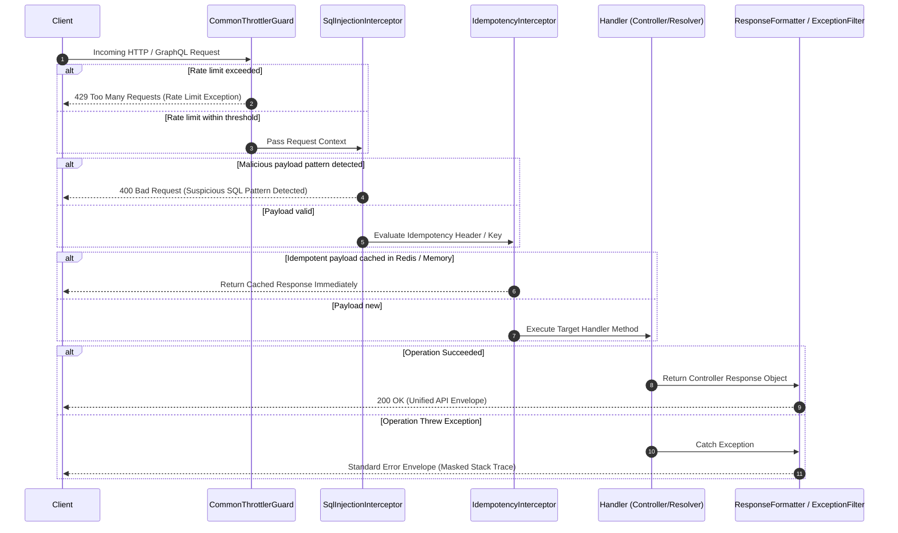
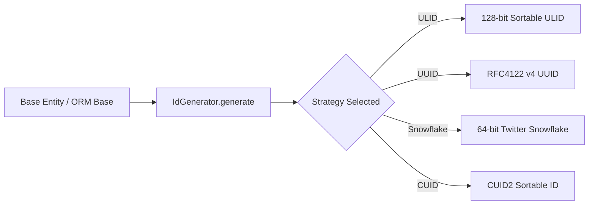

# @bts-soft/common

Production-grade foundational standard library for NestJS enterprise services within the BTS Soft ecosystem. Implements core system design architectural patterns including distributed rate limiting, uniform API response envelopes, deep WAF payload security inspection, multi-ORM abstraction adapters, configurable ID generation strategies, idempotency request deduplication, distributed locking, and context-aware internationalization.

---

## Architectural & Design Overview



### Request Lifecycle Execution Flow



### Configurable ID Generation Strategy Flow



---

## Design Patterns Reference Matrix

| Design Pattern | Implementation Class / Component | Engineering Purpose |
| :--- | :--- | :--- |
| **Strategy Pattern** | `IdGenerator` | Decouples ID generation algorithms (ULID, UUID, Snowflake, CUID2) from entity definitions. |
| **Strategy Pattern** | `TranslationModule` | Dynamically selects locale resolution strategies (`HeaderResolver`, `AcceptLanguageResolver`). |
| **Adapter Pattern** | `TypeOrmBaseEntity`, `MongooseBaseEntity`, `SequelizeBaseEntity`, `PrismaBase` | Adapts agnostic domain entities to specific ORMs without altering core interfaces. |
| **Chain of Responsibility** | `setupInterceptors()` | Chains interceptors (`ClassSerializer`, `SqlInjection`, `GeneralResponse`) sequentially. |
| **Decorator Pattern** | `@CurrentUser()`, `@Public()`, `@SkipSqlCheck()`, `@Idempotent()`, `@DistributedLock()` | Annotates metadata declaratively onto NestJS route handlers and service methods. |
| **Proxy / Deduplication** | `IdempotencyInterceptor` | Intercepts duplicate payload executions using Redis cached responses (`@bts-soft/cache`). |
| **Distributed Lock** | `DistributedLockService` | Coordinates critical section executions across replicas using Redis distributed lock keys (`@bts-soft/cache`). |
| **Exception Filter Pattern** | `RestExceptionFilter`, `HttpExceptionFilter` | Catches and normalizes runtime exceptions into standardized JSON responses. |
| **Factory Pattern** | `ConfigModule.forRoot()`, `ThrottlingModule.forRoot()`, `ResilienceModule.forRoot()` | Encapsulates complex dynamic module instantiation and provider registration. |
| **Transient Service** | `CommonLoggerService` | Manages logger context isolation dynamically per module instantiation (`Scope.TRANSIENT`). |

---

## System Design Interview Concept Mapping

### 1. Rate Limiting & Throttling (Volume 1 - Chapter 4)
- **Token Bucket / Sliding Window Counter**: `ThrottlingModule` and `CommonThrottlerGuard` provide tiered sliding rate limit windows (Short, Medium, Long) to protect downstream microservices against noisy neighbors and Denial-of-Service (DoS) attacks.
- **Protocol Dual Context Extraction**: `CommonThrottlerGuard` dynamically inspects execution context types to resolve IP addresses and request objects for standard HTTP Express requests and Apollo GraphQL execution contexts.

### 2. Distributed Unique ID Generators (Volume 1 - Chapter 7)
- **B-Tree Indexing Optimization**: Random UUID v4 values cause B-Tree index fragmentation and page splits in database engines. `IdGenerator` defaults to lexicographically sortable 128-bit ULIDs (48-bit timestamp + 80-bit randomness) to maintain sequential primary key ordering and high database write throughput.
- **Twitter Snowflake Support**: Supports 64-bit Twitter Snowflake IDs combining millisecond timestamps, worker/machine IDs (0-1023), and sequence counters (0-4095) for distributed microservice node coordination.

### 3. API Gateway Response Enveloping & Contracts (Volume 1 - Chapter 1)
- **Unified API Contract**: `ResponseFormatter` and `GeneralResponseInterceptor` enforce a deterministic JSON response envelope across REST controllers and GraphQL resolvers, ensuring predictable client consuming contracts.
- **Security Information Leakage Mitigation**: `RestExceptionFilter` and `HttpExceptionFilter` catch unhandled errors and strip stack traces and internal system details in production environments.

### 4. Idempotency & Distributed Locking (Volume 1 - Chapter 1 & Distributed Systems)
- **Request Deduplication**: `IdempotencyInterceptor` leverages `RedisService` from `@bts-soft/cache` (or in-memory cache) to prevent duplicate processing of financial or critical mutating requests using `X-Idempotency-Key` headers.
- **Distributed Concurrency Control**: `@DistributedLock()` and `DistributedLockService` use `RedisService` from `@bts-soft/cache` (`acquireLock` / `releaseLock`) to ensure single-replica execution of critical business logic.

### 5. WAF Payload Security Scanning & Resource Protection
- **Deep Payload Inspection**: `SqlInjectionInterceptor` recursively parses body payloads, query strings, and path parameters to block logic bypasses (`' OR '1'='1`), `UNION SELECT` extractions, stacked queries, time-delay attacks (`WAITFOR DELAY`, `pg_sleep`), and system command executions (`xp_cmdshell`).
- **Resource Exhaustion Prevention**: Implements a maximum recursion depth limit of 10 to prevent stack overflow attacks caused by circular JSON payloads, and resets stateful regex `lastIndex` pointers before pattern evaluation.

### 6. Multi-Region Internationalization & Localization
- **Context Routing**: `TranslationModule` inspects incoming request headers (`x-lang` and `Accept-Language`) to deliver localized error messages and content across multi-region deployments.

---

## Module and Component Breakdown

### 1. Core & Agnostic Foundations

#### `AgnosticEntity` (`src/core/bases/AgnosticEntity.ts`)
Pure TypeScript base entity independent of ORMs or framework decorators. Instantiates `id` using `IdGenerator.generate()` and maintains `createdAt` and `updatedAt` timestamps.

#### `BaseEntity` (`src/bases/BaseEntity.ts`)
Agnostic base entity integrated with `class-transformer` (`@Expose()`) for serialization.

#### `BaseResponse` (`src/bases/BaseResponse.ts`)
Standard response model containing default properties when instantiated without arguments:
- `message`: Defaults to `"Operation executed successfully"`
- `success`: Defaults to `true`
- `timeStamp`: Defaults to current ISO timestamp
- `statusCode`: Defaults to `200`

---

### 2. Distributed ID Generator (`src/utils/id-generator.ts`)

Centralized strategy engine supporting 4 unique ID generation strategies:

```typescript
import { IdGenerator } from '@bts-soft/common';

// Set global strategy across the entire application
IdGenerator.setDefaultStrategy('snowflake'); // Options: 'ulid' | 'uuid' | 'snowflake' | 'cuid'

// Configure worker node ID for Twitter Snowflake
IdGenerator.setWorkerId(12);

// Generate ID on demand
const customId = IdGenerator.generate('cuid');
```

---

### 3. Multi-ORM Base Adapters

- **TypeORM (`@bts-soft/common/typeorm`)**: `TypeOrmBaseEntity` extends TypeORM's `BaseEntity` with `@PrimaryColumn`, `@CreateDateColumn`, `@UpdateDateColumn`, and lifecycle hooks (`@AfterInsert`, `@AfterUpdate`, `@BeforeRemove`) using NestJS `Logger`.
- **Mongoose (`@bts-soft/common/mongoose`)**: `MongooseBaseEntity` decorates schemas with `@Schema({ timestamps: true })` and `@Prop()` for `_id` and timestamps.
- **Sequelize (`@bts-soft/common/sequelize`)**: `SequelizeBaseEntity` decorates models with `@Table({ timestamps: true })`, `@PrimaryKey`, `@Column`, `@CreatedAt`, and `@UpdatedAt`.
- **Prisma (`@bts-soft/common/prisma`)**: `PrismaBase` provides helper method `PrismaBase.generateId(strategy?)` and `IPrismaEntity` interface.

---

### 4. Security & Interceptors (`src/interceptors/`)

#### `SqlInjectionInterceptor`
Scans incoming request payloads for SQL injection vectors. Endpoints handling trusted raw SQL can bypass scanning using `@SkipSqlCheck()`.

#### `setupInterceptors(app)`
Helper function to activate global application interceptors:

```typescript
import { setupInterceptors } from '@bts-soft/common';

async function bootstrap() {
  const app = await NestFactory.create(AppModule);
  setupInterceptors(app);
  await app.listen(3000);
}
```

---

### 5. Resilience: Idempotency & Distributed Locking (`@bts-soft/common/resilience`)

Provides idempotency request deduplication and distributed locking using `RedisService` from `@bts-soft/cache`:

```typescript
import { Controller, Post, Body, UseInterceptors } from '@nestjs/common';
import { Idempotent, IdempotencyInterceptor, DistributedLock, DistributedLockService } from '@bts-soft/common/resilience';

@Controller('payments')
export class PaymentController {
  constructor(private readonly distributedLockService: DistributedLockService) {}

  @Post('charge')
  @UseInterceptors(IdempotencyInterceptor)
  @Idempotent({ ttl: 60, headerName: 'x-idempotency-key' })
  async chargeUser(@Body() body: any) {
    return { status: 'processed', transactionId: 'tx_123' };
  }

  @Post('transfer')
  @DistributedLock((body) => `lock:user:${body.userId}`, { ttlMs: 5000 })
  async transferFunds(@Body() body: any) {
    return { status: 'transferred' };
  }
}
```

---

### 6. Infrastructure Modules

#### `ThrottlingModule` (`src/throttler/throttling.module.ts`)
Provides rate limiting via `CommonThrottlerGuard`, supporting both REST HTTP and Apollo GraphQL context extraction.

```typescript
@Module({
  imports: [
    ThrottlingModule.forRoot([
      { name: 'short', ttl: 1000, limit: 10 },
      { name: 'medium', ttl: 10000, limit: 50 },
      { name: 'long', ttl: 60000, limit: 250 },
    ]),
  ],
})
export class AppModule {}
```

#### `GraphqlModule` (`src/graphql/graphql.module.ts`)
Standardized Apollo GraphQL module supporting WebSockets (`graphql-ws`), file uploads (`GraphQLUpload`), CSRF prevention, and Apollo Federation.

```typescript
@Module({
  imports: [
    GraphqlModule.forRoot({
      autoSchemaFile: true,
      playground: true,
      federation: true, // Enables ApolloFederationDriver for microservices
      webSocket: { enabled: true, path: '/graphql', keepAlive: 10000 },
    }),
  ],
})
export class AppModule {}
```

#### `TranslationModule` (`src/translation/translation.module.ts`)
Integrates `nestjs-i18n` with automated path resolution for locales.

---

## Sub-Path Export Matrix

| Sub-Path Export | Exported Components | Description |
| :--- | :--- | :--- |
| `@bts-soft/common` | Core Bases, Decorators, DTOs, Filters, Interceptors, IdGenerator, Modules | Main entry point containing framework agnostic logic |
| `@bts-soft/common/typeorm` | `TypeOrmBaseEntity` | TypeORM model base adapter |
| `@bts-soft/common/sequelize` | `SequelizeBaseEntity` | Sequelize model base adapter |
| `@bts-soft/common/mongoose` | `MongooseBaseEntity` | Mongoose schema base adapter |
| `@bts-soft/common/prisma` | `PrismaBase`, `IPrismaEntity` | Prisma integration base and interface |
| `@bts-soft/common/resilience` | `ResilienceModule`, `IdempotencyInterceptor`, `@Idempotent()`, `@DistributedLock()`, `DistributedLockService` | Request deduplication and Redis distributed locking |

---

## Testing & Quality Assurance

The package includes comprehensive unit and integration test suites:

```bash
# Run unit test suite
npm run test

# Run end-to-end integration tests
npm run test:e2e

# Collect code coverage
npm run test:cov
```

---

## License

MIT License. Developed by Omar Sabry for BTS Soft Infrastructure.