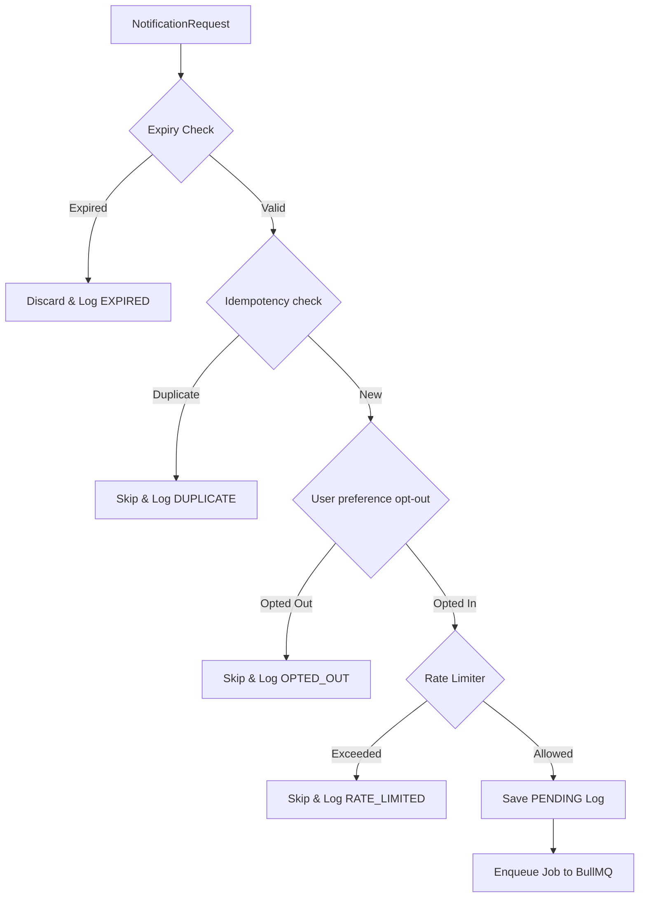
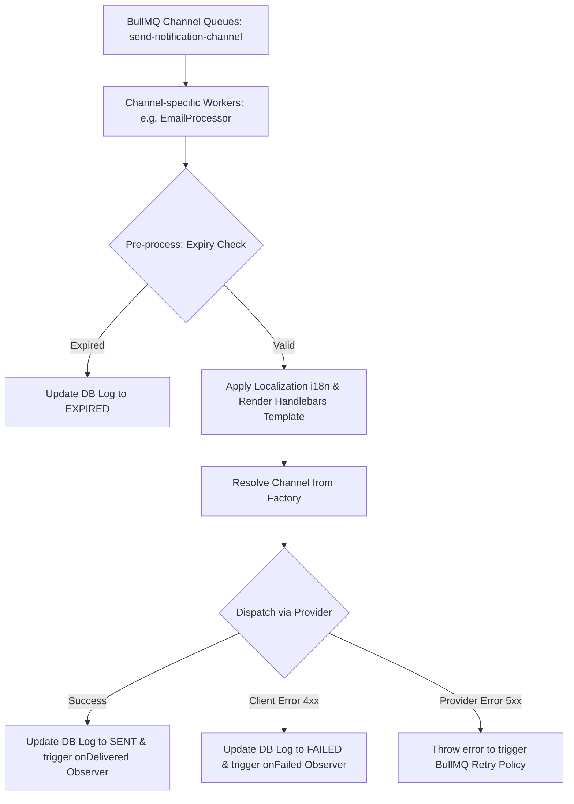

# @bts-soft/notifications

A robust, multi-channel notification engine for NestJS applications. It supports queued delivery, rate limiting, duplicate prevention, and template parsing across Email, SMS, WhatsApp, Push, and Chat platforms.

---

## Features

- **Multi-Channel Dispatching**: Deliver messages via Email (SMTP & SendGrid), SMS & WhatsApp (Twilio), Push Notifications (FCM), Telegram, Discord, Microsoft Teams, Facebook Messenger, Slack, and Webhooks.
- **Pre-flight pipeline**: Automatic validation including message expiry, rate-limiting, user channel opt-out preferences, and idempotency key checks.
- **Queued Execution**: Background task processing powered by BullMQ and Redis with custom retry policies, exponential backoff, task prioritization, and multi-queue channel isolation to prevent cross-channel bottlenecks.
- **Dynamic Templates & localization**: Integrates Handlebars for templating and `nestjs-i18n` for language localization.
- **System monitoring**: Observes message states (queued, delivered, skipped, failed) and updates status logs in the database repository.

---

## System Architecture

The notification engine is divided into a **Pre-flight Pipeline** (executed synchronously upon API calls) and a **Worker Execution Pipeline** (executed asynchronously by background queue processors).

### 1. Pre-flight Pipeline

This phase validates, deduplicates, and limits message requests before adding them to the queue.



### 2. Worker Execution Pipeline

This phase runs asynchronously within channel-specific BullMQ worker processors to render and dispatch messages, providing complete downtime isolation between channels.



---

## Core Concepts

### Deduplication (Idempotency)

Ensures exact message delivery even if network issues cause clients to retry requests. A Redis key `notif:dedup:{idempotencyKey}` is set with a Time-To-Live (TTL). Repeated requests within this window are skipped.

### Rate Limiting

A Redis-backed sliding-window rate limiter stores request timestamps as a sorted set under `notif:rl:{recipientId}:{channel}`. Requests outside the window are removed, and additional requests are denied if the count exceeds the configured limit.

### User Preferences

Enables recipients to opt-out of specific communication channels. If a user opts out, a Redis key `notif:pref:{recipientId}:{channel}` is set, causing the pipeline to skip future notifications on that channel.

### Dynamic Rendering

The payload context is merged into the message body at runtime using **Handlebars** template parsing. In addition, BCP-47 language tags (e.g. `en`, `ar`) are resolved against `nestjs-i18n` translations if provided.

---

## Configuration Variables

Configure the following environment variables in your project's `.env` file:

| Variable Name | Type | Required | Description | Default |
| :--- | :--- | :--- | :--- | :--- |
| `TELEGRAM_BOT_TOKEN` | `string` | Optional | Telegram Bot API authorization token | - |
| `DISCORD_WEBHOOK_URL` | `string` | Optional | Default webhook URL for Discord channel | - |
| `TEAMS_WEBHOOK_URL` | `string` | Optional | Default webhook URL for Teams channel | - |
| `FB_PAGE_ACCESS_TOKEN` | `string` | Optional | Access token for Facebook Messenger Page Graph API | - |
| `FB_GRAPH_API_VERSION` | `string` | Optional | Facebook Graph API version | `v18.0` |
| `TWILIO_ACCOUNT_SID` | `string` | Optional | Twilio Account SID for SMS/WhatsApp | - |
| `TWILIO_AUTH_TOKEN` | `string` | Optional | Twilio Auth Token for SMS/WhatsApp | - |
| `TWILIO_WHATSAPP_NUMBER` | `string` | Optional | WhatsApp-enabled sender phone number | - |
| `TWILIO_SMS_NUMBER` | `string` | Optional | SMS-enabled sender phone number | - |
| `FIREBASE_SERVICE_ACCOUNT_PATH` | `string` | Optional | Path to Firebase credentials JSON file | - |
| `EMAIL_USER` | `string` | Optional | SMTP username / credentials username | - |
| `EMAIL_PASS` | `string` | Optional | SMTP password / credentials password | - |
| `EMAIL_HOST` | `string` | Optional | SMTP host address | - |
| `EMAIL_PORT` | `number` | Optional | SMTP connection port (e.g., 465, 587) | - |
| `EMAIL_SERVICE` | `string` | Optional | Predefined Nodemailer service name | - |
| `EMAIL_SENDER` | `string` | Optional | Outgoing "From" email address display | `EMAIL_USER` |
| `EMAIL_PROVIDER` | `string` | Optional | Mail service provider (`nodemailer` or `twilio-mail`) | `nodemailer` |
| `SENDGRID_API_KEY` | `string` | Optional | SendGrid API authorization key | - |
| `SLACK_WEBHOOK_URL` | `string` | Optional | Default webhook URL for Slack channel | - |
| `SLACK_BOT_TOKEN` | `string` | Optional | Bot OAuth token for Slack Web API | - |
| `SLACK_DEFAULT_CHANNEL` | `string` | Optional | Default destination channel for Slack Bot | - |
| `WEBHOOK_DEFAULT_SIGNING_SECRET` | `string` | Optional | Default secret key for signing webhook payloads | - |

---

## Basic Usage

### 1. Import NotificationModule

Register the module globally or inside your root App module:

```typescript
import { Module } from '@nestjs/common';
import { ConfigModule } from '@nestjs/config';
import { RedisModule } from '@bts-soft/cache';
import { NotificationModule } from '@bts-soft/notifications';

@Module({
  imports: [
    ConfigModule.forRoot({ isGlobal: true }),
    RedisModule.forRoot({
      host: process.env.REDIS_HOST || 'localhost',
      port: parseInt(process.env.REDIS_PORT || '6379'),
    }),
    NotificationModule,
  ],
})
export class AppModule {}
```

### 2. Inject and Send Notifications

Inject the `NotificationService` to queue single or bulk notifications:

```typescript
import { Injectable } from '@nestjs/common';
import { NotificationService, ChannelType } from '@bts-soft/notifications';

@Injectable()
export class OrderService {
  constructor(private readonly notificationService: NotificationService) {}

  async completeOrder(userId: string, email: string) {
    // Send single notification
    await this.notificationService.send(ChannelType.EMAIL, {
      recipientId: email,
      subject: 'Order Completed',
      body: 'Hi {{name}}, your order #{{orderId}} was processed successfully.',
      context: { name: 'John Doe', orderId: '10023' },
    });
  }

  async alertAdministrators() {
    // Send bulk notifications
    await this.notificationService.sendBulk([
      {
        channel: ChannelType.SLACK,
        message: {
          recipientId: '#alerts',
          body: 'System warning: high memory usage detected.',
        },
      },
      {
        channel: ChannelType.SMS,
        message: {
          recipientId: '+1234567890',
          body: 'URGENT: High memory alert on server 1.',
        },
      },
    ]);
  }
}
```

---

## Database Integration & Custom Storage

By default, the notification engine uses an internal logger for notification log entries. You can persist logs to your database (e.g. PostgreSQL or MySQL via TypeORM) by implementing `INotificationLogRepository` and providing it in your module.

### 1. Create a Notification Log Entity

Define your entity according to the database of choice (e.g. TypeORM):

```typescript
import { Entity, PrimaryGeneratedColumn, Column, CreateDateColumn, UpdateDateColumn } from 'typeorm';
import { NotificationStatus } from '@bts-soft/notifications';

@Entity('notification_logs')
export class NotificationLogEntity {
  @PrimaryGeneratedColumn('uuid')
  id: string;

  @Column()
  jobId: string;

  @Column()
  channel: string;

  @Column()
  recipientId: string;

  @Column({
    type: 'varchar',
    default: NotificationStatus.PENDING,
  })
  status: NotificationStatus;

  @Column({ nullable: true })
  errorMessage?: string;

  @Column({ type: 'int', default: 0 })
  attemptsMade: number;

  @CreateDateColumn()
  createdAt: Date;

  @UpdateDateColumn({ nullable: true })
  updatedAt?: Date;
}
```

### 2. Implement the Log Repository

Create a class that implements `INotificationLogRepository`:

```typescript
import { Injectable } from '@nestjs/common';
import { InjectRepository } from '@nestjs/typeorm';
import { Repository } from 'typeorm';
import { INotificationLogRepository, NotificationLog } from '@bts-soft/notifications';
import { NotificationLogEntity } from './notification-log.entity';

@Injectable()
export class DatabaseNotificationLogRepository implements INotificationLogRepository {
  constructor(
    @InjectRepository(NotificationLogEntity)
    private readonly repo: Repository<NotificationLogEntity>,
  ) {}

  async create(log: Omit<NotificationLog, 'id'>): Promise<NotificationLog> {
    const entity = this.repo.create(log as Partial<NotificationLogEntity>);
    return await this.repo.save(entity);
  }

  async updateByJobId(jobId: string, update: Partial<NotificationLog>): Promise<void> {
    await this.repo.update({ jobId }, update as Partial<NotificationLogEntity>);
  }

  async findByJobId(jobId: string): Promise<NotificationLog | null> {
    return await this.repo.findOne({ where: { jobId } });
  }

  async findByRecipientId(recipientId: string): Promise<NotificationLog[]> {
    return await this.repo.find({
      where: { recipientId },
      order: { createdAt: 'DESC' },
    });
  }

  async findAll(filter?: Partial<NotificationLog>): Promise<NotificationLog[]> {
    return await this.repo.find({
      where: filter as any,
      order: { createdAt: 'DESC' },
    });
  }
}
```

### 3. Register the Custom Repository

In your application module, register the repository class using the `NOTIFICATION_LOG_REPOSITORY` injection token:

```typescript
import { Module } from '@nestjs/common';
import { TypeOrmModule } from '@nestjs/typeorm';
import { NotificationModule, NOTIFICATION_LOG_REPOSITORY } from '@bts-soft/notifications';
import { NotificationLogEntity } from './notification-log.entity';
import { DatabaseNotificationLogRepository } from './database-notification-log.repository';

@Module({
  imports: [
    TypeOrmModule.forFeature([NotificationLogEntity]),
    NotificationModule,
  ],
  providers: [
    {
      provide: NOTIFICATION_LOG_REPOSITORY,
      useClass: DatabaseNotificationLogRepository,
    },
  ],
})
export class AppModule {}
```

---

## User Preferences & Opt-Out

To set or manage user channel preferences (opt-in/opt-out), inject the `USER_PREFERENCE_REPOSITORY` token:

```typescript
import { Injectable, Inject } from '@nestjs/common';
import { USER_PREFERENCE_REPOSITORY } from '@bts-soft/notifications';
import type { IUserPreferenceRepository } from '@bts-soft/notifications';

@Injectable()
export class UserPreferenceService {
  constructor(
    @Inject(USER_PREFERENCE_REPOSITORY)
    private readonly preferenceRepo: IUserPreferenceRepository,
  ) {}

  async optOutUserFromSms(userId: string) {
    // Exclude user from receiving future SMS notifications
    await this.preferenceRepo.setOptOut(userId, 'sms', true);
  }

  async optInUserToSms(userId: string) {
    // Enable user to receive SMS notifications
    await this.preferenceRepo.setOptOut(userId, 'sms', false);
  }
}
```

---

## Test Suites & E2E Testing

Running unit tests:

```bash
npm run test
```

Running test coverage:

```bash
npm run test:cov
```

Running end-to-end integration tests (requires docker running for Redis):

```bash
npm run test:e2e
```
