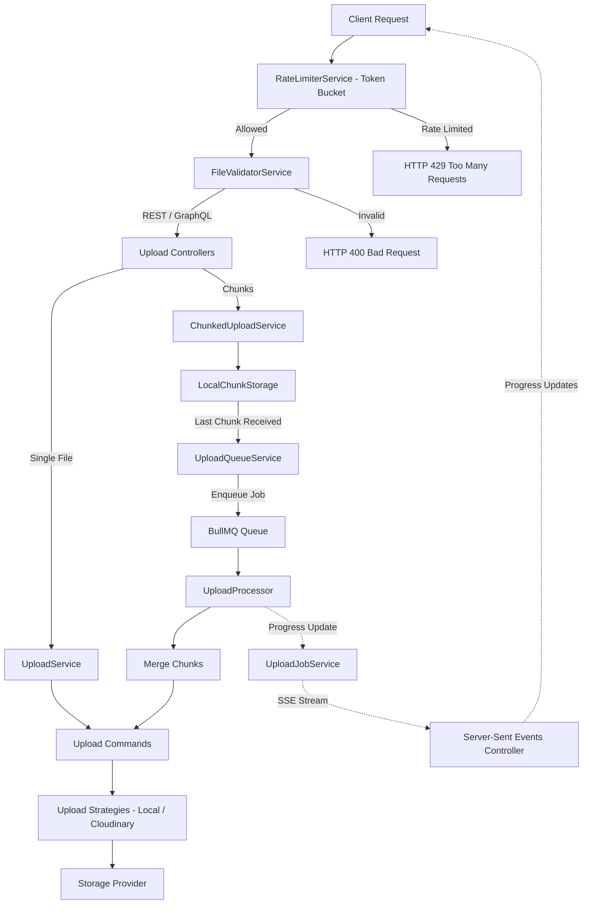

# @bts-soft/upload

An enterprise-grade media orchestration and chunked upload library for NestJS and GraphQL. Designed with clean architecture, the package leverages design patterns (Strategy, Command, Observer) to manage complex file lifecycles with modularity, high performance, and security. It supports multi-provider storage, distributed rate limiting via Redis, asynchronous chunk merging using BullMQ, Server-Sent Events (SSE) for progress streaming, and CDN URL rewriting.

---

## Features

- **Multi-Provider Architecture**: Seamlessly switch between Local Disk storage and Cloudinary at runtime using configuration.
- **Resumable Chunked Uploads**: Native support for large file uploads split into smaller chunks, tracking progress and merging files asynchronously.
- **Distributed Rate Limiting**: Token Bucket rate-limiting algorithm backed by Redis with a transparent in-memory fallback.
- **Asynchronous Queue Processing**: Integrates with BullMQ to perform intensive chunk merging off the main thread.
- **Real-Time Progress Streaming**: Uses Server-Sent Events (SSE) to broadcast merge and upload progress directly to the client.
- **CDN Integration**: Built-in support for rewriting and routing asset URLs via CDNs.
- **Webhook Observers**: Handles background processing notifications from third-party storage providers.
- **Strict Input Validation**: Automatic validation of file extensions, MIME types, and file sizes before ingestion.
- **Design Patterns Driven**:
  - **Strategy Pattern**: Decouples upload and delete implementations from the application core.
  - **Command Pattern**: Encapsulates operations inside safe, transactional commands.
  - **Observer Pattern**: Broadcasts file lifecycle events (upload start, success, fail, delete) to custom observers.
- **Protocol Agnostic**: Supports both REST (Express/Multer) and GraphQL (graphql-upload) APIs.

---

## System Architecture



---

## Installation

Install the package via npm:

```bash
npm install @bts-soft/upload
```

### Peer Dependencies

Ensure you have the following peer dependencies installed in your NestJS project:

```json
{
  "peerDependencies": {
    "@nestjs/common": ">=11.0.0",
    "@nestjs/config": ">=4.0.0",
    "@nestjs/core": ">=11.0.0",
    "@nestjs/graphql": ">=13.0.0"
  }
}
```

---

## Configuration

The package registers config variables dynamically and validates them against a strict schema during startup. Make sure to define the following environment variables.

### Global Settings

| Variable | Type | Default | Description |
| :--- | :--- | :--- | :--- |
| `UPLOAD_PROVIDER` | `local` \| `cloudinary` | `local` | Storage provider strategy to use. |
| `UPLOAD_MAX_IMAGE_SIZE` | number (bytes) | `5242880` (5MB) | Maximum file size for image uploads. |
| `UPLOAD_MAX_VIDEO_SIZE` | number (bytes) | `104857600` (100MB) | Maximum file size for video uploads. |
| `UPLOAD_MAX_AUDIO_SIZE` | number (bytes) | `52428800` (50MB) | Maximum file size for audio uploads. |
| `UPLOAD_MAX_FILE_SIZE` | number (bytes) | `10485760` (10MB) | Maximum file size for documents/raw files. |
| `UPLOAD_MAX_MODEL_3D_SIZE` | number (bytes) | `104857600` (100MB) | Maximum file size for 3D models. |

### Distributed Rate Limiting (Token Bucket)

| Variable | Type | Default | Description |
| :--- | :--- | :--- | :--- |
| `UPLOAD_RATE_LIMIT_CAPACITY` | number | `10` | Maximum token bucket size for chunked uploads. |
| `UPLOAD_RATE_LIMIT_REFILL_RATE`| number | `2` | Number of tokens refilled per second. |

### Local Storage Settings

Required if `UPLOAD_PROVIDER=local`:

| Variable | Type | Default | Description |
| :--- | :--- | :--- | :--- |
| `UPLOAD_LOCAL_PATH` | string | `./uploads` | Absolute or relative path to store files. |

### Cloudinary Storage Settings

Required if `UPLOAD_PROVIDER=cloudinary`:

| Variable | Type | Description |
| :--- | :--- | :--- |
| `CLOUDINARY_CLOUD_NAME` | string | Cloudinary account cloud name. |
| `CLOUDINARY_API_KEY` | string | Cloudinary API Key. |
| `CLOUDINARY_API_SECRET` | string | Cloudinary API Secret. |

---

## Backend Integration Guide (NestJS)

To handle chunk uploads, register jobs, and manage files on the server-side, configure the controllers and services as follows.

### 1. Registering the Module

```typescript
import { Module } from '@nestjs/common';
import { ConfigModule } from '@nestjs/config';
import { UploadModule } from '@bts-soft/upload';

@Module({
  imports: [
    ConfigModule.forRoot({ isGlobal: true }),
    UploadModule,
  ],
})
export class AppModule {}
```

### 2. Implementing the REST Chunk Upload Controller

Create a controller to expose REST API endpoints for chunk initialization, uploading parts, and checking already uploaded chunks.

```typescript
import { Controller, Post, Get, Param, UploadedFile, UseInterceptors, Body, BadRequestException } from '@nestjs/common';
import { FileInterceptor } from '@nestjs/platform-express';
import { ChunkedUploadService } from '@bts-soft/upload';

@Controller('upload')
export class UploadController {
  constructor(private readonly chunkedUploadService: ChunkedUploadService) {}

  // 1. Initiate chunked upload job
  @Post('chunk/initiate')
  async initiateChunkUpload(
    @Body() body: { filename: string; size: number; type: string; fileHash?: string; userId?: string }
  ) {
    if (!body.filename || !body.size || !body.type) {
      throw new BadRequestException('Missing filename, size, or type');
    }
    return this.chunkedUploadService.initiateUpload(
      body.filename,
      body.size,
      body.type,
      body.fileHash,
      body.userId
    );
  }

  // 2. Upload a single chunk part
  @Post('chunk/upload')
  @UseInterceptors(FileInterceptor('file'))
  async uploadChunk(
    @Body() body: { jobId: string; chunkIndex: string; totalChunks: string; fileHash?: string; userId?: string },
    @UploadedFile() file: Express.Multer.File
  ) {
    if (!file) {
      throw new BadRequestException('No file chunk received');
    }
    return this.chunkedUploadService.uploadChunk(
      body.jobId,
      parseInt(body.chunkIndex, 10),
      parseInt(body.totalChunks, 10),
      file.buffer,
      body.fileHash,
      body.userId
    );
  }

  // 3. Retrieve indexes of already uploaded chunks to support resume capability
  @Get('chunk/uploaded/:jobId')
  async getUploadedChunks(@Param('jobId') jobId: string) {
    return this.chunkedUploadService.getUploadedChunks(jobId);
  }
}
```

### 3. GraphQL Controller Integration

Register the `graphql-upload-minimal` middleware in `main.ts` and add mutations inside resolvers:

#### In `main.ts`:
```typescript
import { NestFactory } from '@nestjs/core';
import { AppModule } from './app.module';
import { NestExpressApplication } from '@nestjs/platform-express';
import { graphqlUploadExpress } from 'graphql-upload-minimal';

async function bootstrap() {
  const app = await NestFactory.create<NestExpressApplication>(AppModule);
  
  // Register GraphQL Upload Middleware
  app.use(graphqlUploadExpress({ maxFileSize: 100000000, maxFiles: 10 }));
  
  await app.listen(3000);
}
bootstrap();
```

#### In GraphQL Resolver:
```typescript
import { Resolver, Mutation, Args } from '@nestjs/graphql';
import { UploadService } from '@bts-soft/upload';
import { GraphQLUpload } from 'graphql-upload-minimal';

@Resolver()
export class MediaResolver {
  constructor(private readonly uploadService: UploadService) {}

  @Mutation(() => String)
  async uploadImage(@Args({ name: 'file', type: () => GraphQLUpload }) file: any) {
    const result = await this.uploadService.uploadImage(file);
    return result.url;
  }
}
```

---

## Frontend Integration Guide

This section explains how to implement chunked file uploading, resuming interrupted uploads, and streaming real-time status and progress updates from the backend using Server-Sent Events (SSE).

### 1. Chunked Upload Flow with Resume Capability

This Javascript implementation slices a large file into 5MB chunks, requests already uploaded chunk indexes from the backend (allowing resumption if the upload was interrupted), and uploads missing parts:

```javascript
async function uploadFileInChunks(file, userId = 'user_123') {
  const CHUNK_SIZE = 5 * 1024 * 1024; // 5MB chunk size
  const totalChunks = Math.ceil(file.size / CHUNK_SIZE);
  
  // Step 1: Initiate the chunked upload job
  const initResponse = await fetch('/upload/chunk/initiate', {
    method: 'POST',
    headers: { 'Content-Type': 'application/json' },
    body: JSON.stringify({
      filename: file.name,
      size: file.size,
      type: file.type.startsWith('video/') ? 'video' : 'file',
      userId
    })
  });
  
  const { jobId } = await initResponse.json();
  console.log(`Chunked upload job initiated. Job ID: ${jobId}`);

  // Step 2: Establish connection to the SSE stream to track merging and completion progress
  subscribeToJobProgress(jobId);

  // Step 3: Get already uploaded chunks (in case this is a resumed session)
  const statusResponse = await fetch(`/upload/chunk/uploaded/${jobId}`);
  const uploadedChunkIndexes = await statusResponse.json(); // Array of numbers (e.g. [0, 1])

  // Step 4: Slice and upload each chunk
  for (let i = 0; i < totalChunks; i++) {
    if (uploadedChunkIndexes.includes(i)) {
      console.log(`Chunk ${i} already uploaded. Skipping.`);
      continue;
    }

    const start = i * CHUNK_SIZE;
    const end = Math.min(start + CHUNK_SIZE, file.size);
    const fileChunk = file.slice(start, end);

    const formData = new FormData();
    formData.append('jobId', jobId);
    formData.append('chunkIndex', i.toString());
    formData.append('totalChunks', totalChunks.toString());
    formData.append('file', fileChunk);
    formData.append('userId', userId);

    console.log(`Uploading chunk ${i + 1}/${totalChunks}...`);
    
    const uploadResponse = await fetch('/upload/chunk/upload', {
      method: 'POST',
      body: formData
    });

    if (!uploadResponse.ok) {
      throw new Error(`Failed to upload chunk ${i}`);
    }
  }
}
```

### 2. Consuming Real-Time SSE Progress Streams

The server broadcasts progress messages through Server-Sent Events during asynchronous chunk merging. Consume this stream on the client side:

```javascript
function subscribeToJobProgress(jobId) {
  const eventSource = new EventSource(`/upload/jobs/${jobId}/stream`);

  eventSource.onmessage = (event) => {
    const payload = JSON.parse(event.data);
    
    switch (payload.type) {
      case 'progress':
        console.log(`Processing/Merging Progress: ${payload.progress}%`);
        break;
        
      case 'completed':
        console.log(`Upload successful! Accessible URL: ${payload.url}`);
        eventSource.close();
        break;
        
      case 'failed':
        console.error(`Upload/Merge failed: ${payload.error}`);
        eventSource.close();
        break;
    }
  };

  eventSource.onerror = (err) => {
    console.error('SSE Stream encountered an error:', err);
    eventSource.close();
  };
}
```

---

## API Reference

### UploadService

Directly uploads files using strategies.

- `uploadImageCore(file: UploadStreamInput): Promise<UploadResult>`
- `uploadVideoCore(file: UploadStreamInput): Promise<UploadResult>`
- `uploadAudioCore(file: UploadStreamInput): Promise<UploadResult>`
- `uploadFileCore(file: UploadStreamInput): Promise<UploadResult>`
- `uploadModel3dCore(file: UploadStreamInput): Promise<UploadResult>`
- `deleteImage(url: string): Promise<boolean>`
- `deleteVideo(url: string): Promise<boolean>`
- `deleteAudio(url: string): Promise<boolean>`
- `deleteFile(url: string): Promise<boolean>`

### ChunkedUploadService

Manages state and storage for chunked uploads.

- `initiateUpload(filename: string, size: number, type: string, fileHash?: string, userId?: string): Promise<{ jobId: string, status: string }>`
- `uploadChunk(jobId: string, chunkIndex: number, totalChunks: number, buffer: Buffer, fileHash?: string, userId?: string): Promise<{ progress: number, completed: boolean }>`
- `getUploadedChunks(jobId: string): Promise<number[]>`

### RateLimiterService

Enforces Token Bucket rate limiting.

- `consume(key: string): Promise<boolean>`: Consumes one token from the bucket identified by `key`. Returns `true` if consumed, `false` if rate-limited.

---

## Custom Lifecycle Observers

Register custom observers to hook into file uploads, completions, and deletions.

Create a provider implementing `IUploadObserver`:

```typescript
import { Injectable, OnModuleInit } from '@nestjs/common';
import { IUploadObserver, UploadObserverManager } from '@bts-soft/upload';

@Injectable()
export class FileAuditService implements IUploadObserver, OnModuleInit {
  constructor(private readonly observerManager: UploadObserverManager) {}

  onModuleInit() {
    this.observerManager.register(this);
  }

  async onUploadSuccess(url: string, type: string, metadata?: any): Promise<void> {
    console.log(`Asset uploaded successfully: ${url} (Type: ${type})`);
  }

  async onUploadFail(error: Error, metadata?: any): Promise<void> {
    console.error(`Asset upload failed: ${error.message}`);
  }

  async onDeleteSuccess(url: string): Promise<void> {
    console.log(`Asset deleted successfully: ${url}`);
  }

  async onDeleteFail(error: Error, url: string): Promise<void> {
    console.error(`Failed to delete asset ${url}: ${error.message}`);
  }
}
```

---

## Testing

The library contains unit and E2E test suites with fully mocked network dependencies and automatic filesystem cleanups.

```bash
# Run unit tests
npm run test

# Run E2E integration tests
npm run test:e2e

# Run test coverage
npm run test:cov
```

---

## License

MIT © BTS Soft - Developed by Omar Sabry.