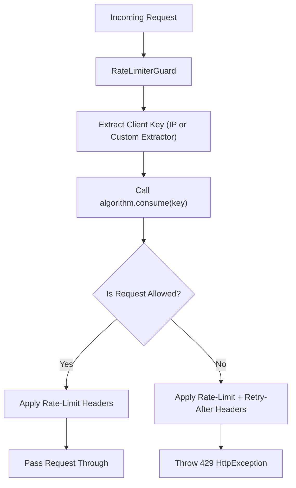

# @bts-soft/validation

An enterprise-grade validation, sanitization, and rate-limiting toolkit for NestJS applications. This package is designed from the ground up to be protocol-agnostic, offering seamless support for both REST (Express/Fastify) and GraphQL (Apollo/Mercurius) APIs. It provides composite validation decorators that consolidate structural, type, and security checks (such as SQL injection detection) with automatic data transformation (via class-transformer) into singular, reusable annotations. 

Additionally, the package includes a highly customizable rate-limiting suite implementing the five standard rate-limiting algorithms, with pluggable support for distributed Redis storage and process-local memory storage.

---

## Table of Contents

1. [Key Features](#key-features)
2. [Installation](#installation)
3. [Protocol-Agnostic Design](#protocol-agnostic-design)
4. [Decorators Reference](#decorators-reference)
   - [Identity & Security Decorators](#identity--security-decorators)
   - [String & Text Decorators](#string--text-decorators)
   - [Contact & Web Decorators](#contact--web-decorators)
   - [Primitive & Logical Decorators](#primitive--logical-decorators)
   - [Utility Transformations](#utility-transformations)
5. [Rate Limiting Suite](#rate-limiting-suite)
   - [Architectural Flow](#architectural-flow)
   - [Storage Backends](#storage-backends)
   - [Detailed Algorithm Implementations](#detailed-algorithm-implementations)
   - [Configuration Reference](#configuration-reference)
   - [Usage Patterns](#usage-patterns)
   - [GraphQL Integration](#graphql-integration)
   - [Client IP Extraction Strategy](#client-ip-extraction-strategy)
   - [Response Headers](#response-headers)
6. [SQL Injection Prevention](#sql-injection-prevention)
7. [Testing and Verification](#testing-and-verification)
8. [License](#license)

---

## Key Features

- Protocol-agnostic composite decorators matching validation rules to both NestJS ValidationPipe (class-validator) and GraphQL Field schema declarations.
- Direct integration with class-transformer for auto-sanitization (e.g., telephone digit isolation, case normalization, and title-casing).
- Built-in SQL injection auditing on string fields using negative lookahead regex constraints.
- Custom rate-limiting guard with five design patterns: Token Bucket, Leaking Bucket, Fixed Window, Sliding Window Log, and Sliding Window Counter.
- Self-healing rate-limit storage architecture: auto-resolves to Redis when available and falls back to in-memory storage on failure or missing configurations.
- Zero external runtime dependencies for in-memory operations; relies on standard peer-dependency interfaces.

---

## Installation

Install the package via npm:

```bash
npm install @bts-soft/validation
```

Ensure the following peer dependencies are installed in your NestJS project:

```json
{
  "peerDependencies": {
    "@bts-soft/cache": ">=1.1.4",
    "@nestjs/common": ">=11.0.0",
    "@nestjs/core": ">=11.0.0",
    "@nestjs/graphql": ">=13.0.0",
    "class-transformer": "^0.5.1",
    "class-validator": "^0.14.1",
    "reflect-metadata": "^0.2.0"
  }
}
```

---

## Protocol-Agnostic Design

All validation decorators in this package are composite decorators built using NestJS `applyDecorators`. They accept two universal configuration flags:

- `isGraphql` (boolean, default: `true`): When true, the decorator applies the `@Field()` decorator from `@nestjs/graphql` matching the appropriate primitive type (String, Float, Int, Boolean, or Date). When false, the GraphQL field mapping is omitted, allowing the DTO to be used in pure REST controllers without requiring the `@nestjs/graphql` package at runtime.
- `optional` (boolean, default: `true`): When true, applies the `@IsOptional()` decorator. Set to false to enforce required fields.

---

## Decorators Reference

### Identity & Security Decorators

#### IdField

Validates unique identifiers such as ULIDs, UUIDs, or primary keys of a specific length.

- Signature:
  ```typescript
  export function IdField(
    id: string,
    length = 26,
    nullable = false,
    isGraphql = true,
    optional = true,
  ): PropertyDecorator
  ```
- Constraints: Enforces string type, validates that the length is exactly `length` characters, checks against SQL injection patterns, and applies optional GraphQL Field metadata.
- Example:
  ```typescript
  @IdField('User', 26, false, true, false)
  userId: string;
  ```

#### NationalIdField

Validates Egyptian National ID numbers.

- Signature:
  ```typescript
  export function NationalIdField(
    nullable = false,
    isGraphql = true,
    optional = true,
  ): PropertyDecorator
  ```
- Constraints:
  - Sanitization: Removes all non-digit characters (`/\D/g`) before validation.
  - Length: Enforces exactly 14 digits.
  - Egyptian Rule: Ensures the ID starts with `2` (born 1900-1999) or `3` (born 2000-2099).
- Example:
  ```typescript
  @NationalIdField(false, false, false)
  nationalId: string;
  ```

#### PasswordField

Validates passwords against configurable length and complexity profiles.

- Signature:
  ```typescript
  export function PasswordField(
    min = 8,
    max = 16,
    complexity: PasswordComplexity = PasswordComplexity.ALPHANUMERIC,
    nullable = false,
    isGraphql = true,
    optional = false,
    checkSql = true,
  ): PropertyDecorator
  ```
- Complexity Profiles:
  - `PasswordComplexity.ALPHANUMERIC` (default): Requires at least one uppercase letter, one lowercase letter, and one number.
  - `PasswordComplexity.SYMBOLIC`: Requires at least one uppercase letter, one lowercase letter, and one special character (symbol).
  - `PasswordComplexity.COMPREHENSIVE`: Requires at least one uppercase letter, one lowercase letter, one number, and one special character.
- Example:
  ```typescript
  @PasswordField(12, 32, PasswordComplexity.COMPREHENSIVE, false, true, false, true)
  password: string;
  ```

---

### String & Text Decorators

#### TextField

General-purpose text validator that sanitizes input to lowercase.

- Signature:
  ```typescript
  export function TextField(
    text: string,
    min = 1,
    max = 255,
    nullable = false,
    isGraphql = true,
    optional = true,
    checkSql = true,
  ): PropertyDecorator
  ```
- Constraints: Only permits letters, numbers, spaces, commas, periods, hyphens, and the Arabic script character block (`\u0600-\u06FF`).
- Sanitization: Automatically maps the value to lowercase using the `LowerWords` utility.
- Example:
  ```typescript
  @TextField('City Name', 2, 50, false, true, true)
  city: string;
  ```

#### CapitalTextField

Text validator that auto-capitalizes terms such as location names or proper nouns.

- Signature:
  ```typescript
  export function CapitalTextField(
    text: string,
    min = 1,
    max = 255,
    nullable = false,
    isGraphql = true,
    optional = true,
    checkSql = true,
  ): PropertyDecorator
  ```
- Constraints: Allows only letters, spaces, and the Arabic Unicode block (numbers and symbols are forbidden).
- Sanitization: Automatically capitalizes the first letter of each word (Title Case) via `CapitalizeWords`.
- Example:
  ```typescript
  @CapitalTextField('State', 2, 100, false, true, false)
  state: string;
  ```

#### NameField

Specifically tailored to validating human names.

- Signature:
  ```typescript
  export function NameField(
    text: string,
    min = 2,
    max = 100,
    nullable = false,
    isGraphql = true,
    optional = true,
    checkSql = true,
  ): PropertyDecorator
  ```
- Constraints: Allows only letters (Latin and Arabic alphabets) and spaces.
- Sanitization: Transforms input to Title Case.
- Example:
  ```typescript
  @NameField('FullName', 3, 80, false, true, false)
  name: string;
  ```

#### UsernameField

Enforces system handle rules.

- Signature:
  ```typescript
  export function UsernameField(
    nullable = false,
    isGraphql = true,
    optional = true,
    checkSql = true,
  ): PropertyDecorator
  ```
- Constraints: Enforces length between 3 and 30 characters. Restricts characters to alphanumeric characters and underscores. Must start with a letter.
- Example:
  ```typescript
  @UsernameField(false, true, false)
  username: string;
  ```

#### DescriptionField

Designed for long-form multi-line text submissions.

- Signature:
  ```typescript
  export function DescriptionField(
    text: string,
    min = 10,
    max = 2000,
    nullable = false,
    isGraphql = true,
    optional = true,
    checkSql = true,
  ): PropertyDecorator
  ```
- Constraints: Permits alphanumeric characters, basic punctuation (`. , ! ? ( ) - _`), newlines (`\n\r`), spaces, and Arabic text.
- Sanitization: Converts the input to lowercase.
- Example:
  ```typescript
  @DescriptionField('Biography', 20, 1500, false, true, true)
  bio: string;
  ```

---

### Contact & Web Decorators

#### EmailField

Validates email addresses.

- Signature:
  ```typescript
  export function EmailField(
    nullable = false,
    isGraphql = true,
    optional = true,
  ): PropertyDecorator
  ```
- Constraints: Standard RFC-compliant email verification. Checks for SQL injection patterns.
- Sanitization: Converts email address to lowercase.
- Example:
  ```typescript
  @EmailField(false, true, false)
  email: string;
  ```

#### PhoneField

Validates phone numbers using the global `libphonenumber-js` engine.

- Signature:
  ```typescript
  export function PhoneField(
    format: CountryCode = 'EG',
    nullable = false,
    isGraphql = true,
    optional = true,
    checkSql = true,
  ): PropertyDecorator
  ```
- Constraints: Validates the phone format against the provided ISO 2-letter country code.
- Sanitization: Removes all non-digit and non-plus characters (`/[^\d+]/g`) before running the validation check.
- Example:
  ```typescript
  @PhoneField('US', false, true, false)
  phoneNumber: string;
  ```

#### UrlField

Validates web URLs.

- Signature:
  ```typescript
  export function UrlField(
    text = 'url',
    nullable = false,
    isGraphql = true,
    optional = true,
    checkSql = true,
  ): PropertyDecorator
  ```
- Constraints: Ensures standard URL structure (including protocol).
- Sanitization: Converts input string to lowercase.
- Example:
  ```typescript
  @UrlField('Website URL', false, true, true)
  website: string;
  ```

---

### Primitive & Logical Decorators

#### NumberField

Validates numbers, supporting range parameters and integer restrictions.

- Signature:
  ```typescript
  export function NumberField(
    text: string,
    min?: number,
    max?: number,
    isInt = false,
    nullable = false,
    isGraphql = true,
    optional = true,
  ): PropertyDecorator
  ```
- Constraints: Asserts the property is numeric. Optionally restricts to integers, and enforces minimum and maximum boundaries.
- GraphQL Type: Automatically sets the GraphQL field type to `Int` if `isInt` is true, otherwise uses `Float`.
- Example:
  ```typescript
  @NumberField('Age', 18, 100, true, false, true, false)
  age: number;
  ```

#### BooleanField

Validates strict boolean values.

- Signature:
  ```typescript
  export function BooleanField(
    nullable = false,
    isGraphql = true,
    optional = true,
  ): PropertyDecorator
  ```
- Constraints: Ensures value is a literal boolean (`true` or `false`).
- Example:
  ```typescript
  @BooleanField(false, true, false)
  isActive: boolean;
  ```

#### DateField

Validates date representations and parses them into JS Date objects.

- Signature:
  ```typescript
  export function DateField(
    text: string,
    nullable = false,
    isGraphql = true,
    optional = true,
  ): PropertyDecorator
  ```
- Transformation: Uses `class-transformer` to convert incoming ISO strings or epoch numbers into Javascript `Date` objects.
- Constraints: Enforces that the parsed value is a valid `Date`.
- Example:
  ```typescript
  @DateField('Birthdate', false, true, false)
  dob: Date;
  ```

#### EnumField

Validates values against a specific TypeScript Enum.

- Signature:
  ```typescript
  export function EnumField(
    enumType: object,
    name: string,
    nullable = false,
    isGraphql = true,
    optional = true,
  ): PropertyDecorator
  ```
- Constraints: Validates that the property exists within the keys of `enumType`.
- Example:
  ```typescript
  enum UserRole {
    ADMIN = 'admin',
    USER = 'user'
  }

  @EnumField(UserRole, 'UserRole', false, true, false)
  role: UserRole;
  ```

---

### Utility Transformations

The package exports two utility functions representing the core string transformations used by the decorators:

- `LowerWords(value: string): string`
  Converts the input string to lowercase. Safe for non-string values.
- `CapitalizeWords(value: string): string`
  Converts the input string to Title Case, capitalizing the first letter of each space-delimited word and converting all other letters to lowercase.

---

## Rate Limiting Suite

The rate limiter feature in `@bts-soft/validation` implements the five core rate-limiting patterns described in Alex Xu's *System Design Interview* book. It works out of the box for both REST controllers and GraphQL resolvers, automatically applying standard rate-limiting headers.

### Architectural Flow



### Storage Backends

Rate limit algorithms operate against an implementation of the `IRateLimiterStore` interface:

```typescript
export interface IRateLimiterStore {
  get<T = unknown>(key: string): Promise<T | undefined>;
  set<T = unknown>(key: string, value: T, ttlSeconds?: number): Promise<void>;
  delete(key: string): Promise<void>;
  clear(): Promise<void>;
  destroy?(): Promise<void> | void;
}
```

The package provides two storage backends:

- **RedisStore**: Distributed storage backed by the `@bts-soft/cache` package. It shares request metrics and counts across all running application instances. If the Redis server is unreachable, the store logs a warning and dynamically falls back to the in-memory engine to guarantee service continuity.
- **InMemoryStore**: A local, zero-dependency storage system that maintains client state in a standard JavaScript `Map`. Expired entries are removed lazily upon access and proactively by a background cleanup interval running every 60 seconds.

---

### Detailed Algorithm Implementations

#### 1. Token Bucket

- Concept: Each client key corresponds to a bucket holding up to `limit` tokens. Each request consumes exactly 1 token. Tokens replenish continuously at a rate of `limit / windowMs` tokens per millisecond, capped at `limit`.
- Characteristics:
  - Supports short bursts of traffic up to the bucket capacity.
  - Guarantees that average throughput over time does not exceed the refill rate.
  - Highly memory-efficient (O(1) storage complexity per client key).
- Use Case: General API endpoints that can experience momentary usage spikes but must be restricted to a long-term average limit.

#### 2. Leaking Bucket

- Concept: Requests enter a queue of fixed capacity (`limit`). The queue drains at a constant rate of `limit / windowMs` requests per millisecond. If the queue is full when a new request arrives, it is immediately rejected.
- Characteristics:
  - Produces a smooth, predictable request outflow rate.
  - Absorbs small bursts up to the queue capacity.
  - Excess traffic is rejected, not delayed.
  - Highly memory-efficient (O(1) storage complexity per client key).
- Use Case: Sensitive write actions, checkout systems, payment processing, or downstream third-party integrations with strict processing limits.

#### 3. Fixed Window Counter

- Concept: Divides time into fixed, non-overlapping windows of `windowMs` duration. Each client key maintains a counter for the current window. The counter resets when a request lands inside a new window boundary.
- Characteristics:
  - Simplest rate limiting algorithm.
  - Highly memory-efficient (O(1) storage complexity per client key).
  - Susceptible to the boundary burst issue: clients can send double the limit by sending requests at the tail end of one window and the start of the next.
- Use Case: Low-overhead rate limits where absolute precision is secondary (e.g., limiting login attempts).

#### 4. Sliding Window Log

- Concept: Keeps a sorted log of the exact Unix timestamps of all requests sent by a client within the rolling window. On each request, timestamps older than `now - windowMs` are purged. If the remaining count is less than `limit`, the request timestamp is appended to the log.
- Characteristics:
  - Absolute precision: completely eliminates boundary burst vulnerabilities.
  - Memory consumption scales with the request limit size (O(limit) storage complexity per client key).
- Use Case: High-security operations or paid API endpoints requiring precise quota compliance regardless of client request patterns.

#### 5. Sliding Window Counter

- Concept: Approximates a sliding window using two counters: the previous window counter and the current window counter. The rolling count is estimated using a weighted average based on the progress of the current window:
  ```
  estimatedCount = prevCount * (1 - (timeElapsedInCurrentWindow / windowMs)) + currCount
  ```
- Characteristics:
  - Eliminates the boundary burst problem without logging individual request timestamps.
  - Exceptionally low memory usage (O(1) storage complexity per client key).
  - Minimal estimation error (empirically around 0.003% error rate on typical traffic patterns).
- Use Case: Highly-scaled endpoints where precision is required but Sliding Window Log memory overhead is too costly.

---

### Configuration Reference

The `RateLimiter` factory and the `@RateLimit` decorator accept the `RateLimiterConfig` configuration object:

| Configuration Property | Type | Required | Default Value | Technical Description |
|:---|:---|:---|:---|:---|
| `algorithm` | `RateLimiterAlgorithm` | Yes | — | Selects the rate-limiting algorithm (`TOKEN_BUCKET`, `LEAKING_BUCKET`, `FIXED_WINDOW_COUNTER`, `SLIDING_WINDOW_LOG`, `SLIDING_WINDOW_COUNTER`). |
| `limit` | `number` | Yes | — | Maximum requests allowed per window (or queue/bucket capacity). |
| `windowMs` | `number` | Yes | — | Time window duration in milliseconds. |
| `keyExtractor` | `(req: any) => string` | No | Client IP | Custom extractor function to map the HTTP request object to a rate-limiting key. |
| `message` | `string` | No | `'Too many requests, please try again later.'` | JSON error message payload returned when client is rate-limited. |
| `statusCode` | `number` | No | `429` | HTTP status code returned upon rate-limiting rejection. |
| `skipIntrospection` | `boolean` | No | `true` | When true, GraphQL introspection queries bypass rate limiting. |

---

### Usage Patterns

#### Pattern 1: Controller-Level Decorator

Protects all route handlers within a controller under a shared rate-limit policy.

```typescript
import { Controller, Get } from '@nestjs/common';
import { RateLimit, RateLimiterAlgorithm } from '@bts-soft/validation';

@RateLimit({
  algorithm: RateLimiterAlgorithm.SLIDING_WINDOW_COUNTER,
  limit: 100,
  windowMs: 60000,
})
@Controller('users')
export class UserController {
  @Get('profile')
  getProfile() {
    return { status: 'success' };
  }
}
```

#### Pattern 2: Handler-Level Decorator

Overrides controller-level limits or isolates rate limits to a specific handler.

```typescript
import { Controller, Get } from '@nestjs/common';
import { RateLimit, RateLimiterAlgorithm } from '@bts-soft/validation';

@Controller('billing')
export class BillingController {
  @RateLimit({
    algorithm: RateLimiterAlgorithm.TOKEN_BUCKET,
    limit: 5,
    windowMs: 10000,
  })
  @Get('pay')
  processPayment() {
    return { processed: true };
  }
}
```

#### Pattern 3: Explicit Custom Key Extractor

Define custom rate limiting identifiers (such as user ID from JWT, API keys, or tenant IDs).

```typescript
import { Controller, Get } from '@nestjs/common';
import { RateLimit, RateLimiterAlgorithm } from '@bts-soft/validation';

@RateLimit({
  algorithm: RateLimiterAlgorithm.SLIDING_WINDOW_LOG,
  limit: 10,
  windowMs: 60000,
  keyExtractor: (req) => req.user?.id ?? req.headers['x-api-key'] ?? req.ip,
})
@Controller('api')
export class ApiController {
  @Get('data')
  getData() {
    return { data: 'payload' };
  }
}
```

---

### GraphQL Integration

The rate limiter supports GraphQL resolvers natively. It intercepts the NestJS ExecutionContext, extracts the GraphQL resolver details, and parses the request and response contexts lazily.

If a schema discovery query (GraphQL Introspection) is sent, the guard automatically bypasses it when `skipIntrospection` is `true`.

```typescript
import { Resolver, Query } from '@nestjs/graphql';
import { RateLimit, RateLimiterAlgorithm } from '@bts-soft/validation';

@Resolver()
export class UserResolver {
  @RateLimit({
    algorithm: RateLimiterAlgorithm.TOKEN_BUCKET,
    limit: 30,
    windowMs: 60000,
  })
  @Query(() => String)
  getUserMetaData() {
    return 'GraphQL response';
  }
}
```

---

### Client IP Extraction Strategy

When a custom `keyExtractor` is omitted, client identifiers are resolved via the `extractIp` utility. It searches the HTTP request using the following sequential strategy:

1. `x-forwarded-for` header: Parsed from left to right. The first IP in the list is returned (the origin client).
2. `x-real-ip` header: Commonly populated by reverse proxies like Nginx.
3. `req.ip`: The native NestJS / Express / Fastify IP resolution property.
4. `req.socket.remoteAddress`: Fallback raw TCP socket address.
5. `'unknown'`: Returned when no network metadata is present (e.g. testing environments).

---

### Response Headers

The guard appends RFC-compliant and custom headers to HTTP responses for client integration:

- `X-RateLimit-Limit`: The maximum number of allowed requests configured within the rate-limit window.
- `X-RateLimit-Remaining`: The remaining number of permitted requests for the client in the current window.
- `X-RateLimit-Reset`: Unix epoch timestamp in seconds indicating when the current window resets.
- `Retry-After`: The number of seconds a client must wait before retrying the request. This header is only present when the rate limit has been exceeded (429 HTTP status).

---

## SQL Injection Prevention

String-based input fields are audited against SQL injection (SQLi) patterns using the exported `SQL_INJECTION_REGEX` expression:

```javascript
/^(?!.*(\b(SELECT|INSERT|DELETE|UPDATE|DROP|UNION|EXEC|TRUNCATE|ALTER|CREATE)\b|--|;)).*$/i
```

### Regular Expression Analysis

- `^ ... $`: Enforces validation across the entire input string.
- `(?! ... )`: Negative lookahead assertion that fails the match if the enclosed patterns are found.
- `\b(SELECT|...)\b`: Targets common SQL keywords as distinct words. Modifiers like `i` ensure case insensitivity.
- `--`: Matches double-hyphen sequence used to start comments in SQL databases.
- `;`: Matches semicolon statement terminators.

If any of these sequences are found in fields like `TextField`, `PasswordField`, `PhoneField`, `UrlField`, `NameField`, `UsernameField`, or `DescriptionField`, validation fails and throws a NestJS `BadRequestException` (400).

---

## Testing and Verification

The package comes equipped with Jest configurations for running unit, integration, and E2E test suites.

### Testing Commands

```bash
# Run unit tests across all decorators, stores, and rate limiter algorithms
npm run test

# Run unit tests in watch mode
npm run test:watch

# Execute the test suite and output a detailed test coverage report
npm run test:cov

# Execute end-to-end integration tests within a mocked NestJS application context
npm run test:e2e
```

### Test Coverage Architecture

- Decorators are validated against both positive scenarios (valid formatted structures) and negative scenarios (SQLi injections, wrong formatting, length violations).
- Rate limiter algorithms are validated in fast-forward Jest contexts verifying exact remaining token offsets, timestamp purges, queue structures, and counter updates.
- Storage classes (`InMemoryStore` and `RedisStore`) are fully tested to confirm TTL expiration behavior and fallback behavior when connections drop.

---

## License

This package is licensed under the MIT License. See the [license](file:///d:/projects/BTS%20Software/packages/validation/license) file for details.

Copyright © 2026 BTS Soft. Developed by Omar Sabry.
